# Web App Dev 2 - Assignment 1 - ReactJS app.

Name: Máté Domonics (20093156)

## Overview.

### New Pages.

[ Provide a bullet-point list of the new pages you added to the Movies Fan add (include modifications to existing pages).]

+ Home - Site Header changes.
+ Movie Details - Added the Similar Movies Button.
+ Similar Movies Page - Displaying a list of movies that have the same genre as the original movie selected.
+ Upcoming - No changes.
+ Top Rated Movies - Displaying a list of movies that have the highest rating.
+ TV Series - Displaying a list of TV series in a "discover" fashion, just like the movie list.
+ Similar TV Series - Similar to Similar Movies Page.
+ Favourite Movies - Name changed to make it easier to differentiate
+ Favourite TV Series - When a TV Series is favourited, it is stored here and can be viewed.
+ TV Series Reviews - View a full review in detail.

### New Features.

[ Provide a bullet-point list of the __new features__ you added to the Movies Fan app.] 

+ Similar Movies
+ TV Series with support for favouriting
+ Similar TV Series
+ Storybook Support
+ Viewing TV Reviews

## Setup requirements.

+ .env must include API Key and `FAST_REFRESH=false`

## TMDB endpoints.

[ List the __additional__ TMDB endpoints used, giving the description and pathname for each one.] 

+ /movie/top_rated - Top Rated Movies page
+ /movie/{movie_id}/similar - When entering a Movie's description page and clicking the "Similar Movies..." button, you are brought to this page, showing the movies that share the same genres as the original.
+ /discover/tv - Discover TV Series page
+ /tv/{tv_id} - TV Series Details page
+ /tv/{tv_id}/images - Populating the poster images for each TV Series
+ /tv/{tv_id}/similar - Similar to Similar Movies above
+ /tv/{tv_id}/reviews - Getting the reviews for each TV Series.

## App Design.

### Component catalogue.

[ Insert a screenshot from the Storybook UI, and highlight the stories that relate to your __new/modified components__ - see the example screenshot below.]

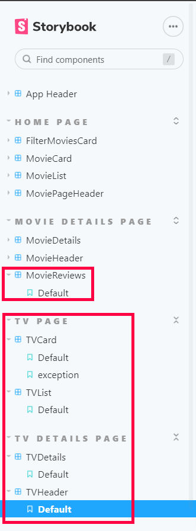

### UI Design.

[ Insert screenshots of the __new app pages__ you developed (including modified existing pages), Have an appropriate caption for each one (see example below).

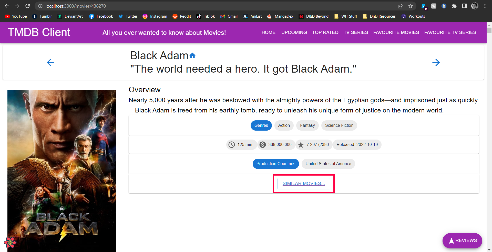

>Shows the Movie Details Page as usual, but I added a "Similar Movies..." Button that brings the user to the Similar Movies Page, based on the movie that the button was pressed in.

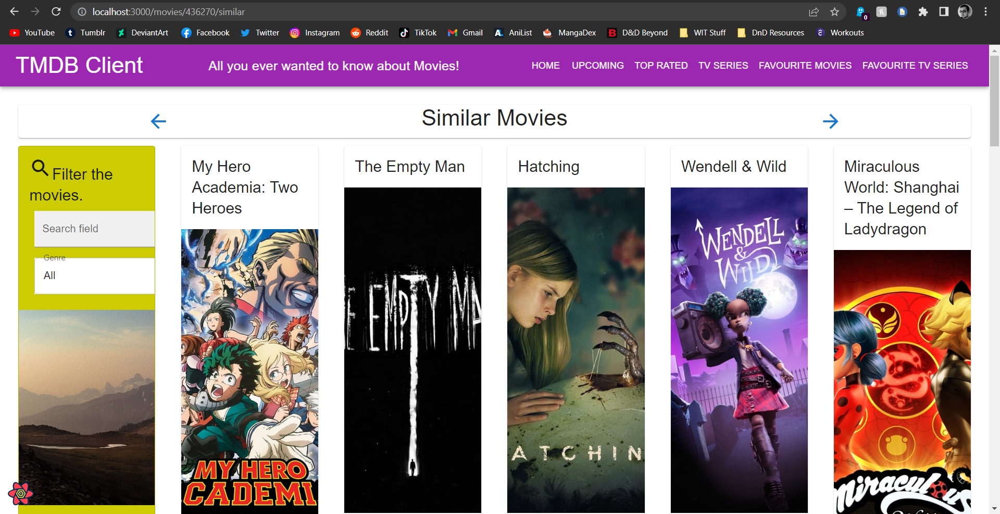

>Shows the Similar Movies Page, which is a list similar to the Discover Movies page, except based on the Movie ID of the selected movie, where only the movies with the same genres are displayed.

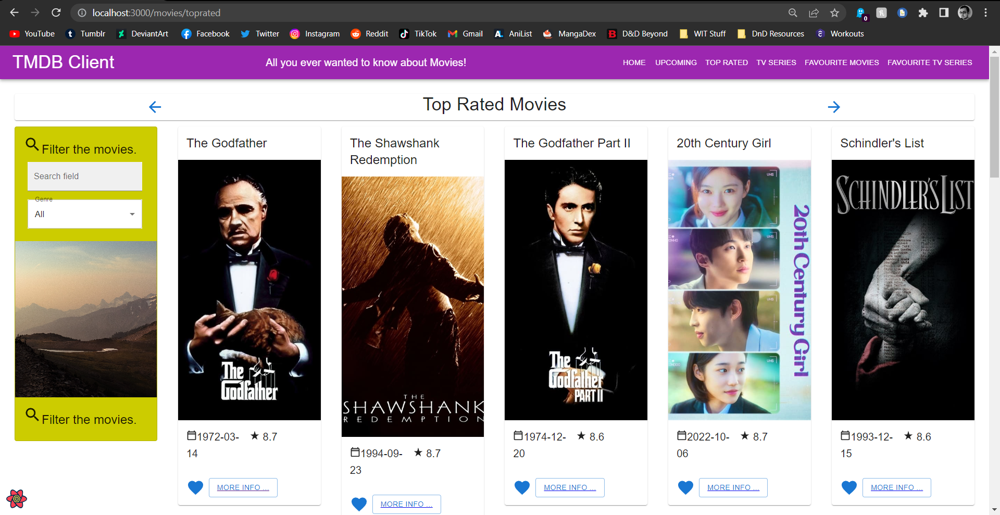

>Shows the Top Rated Movies Page, which is also similar to the Discover Movies page. It displays the top rated movies of all time.

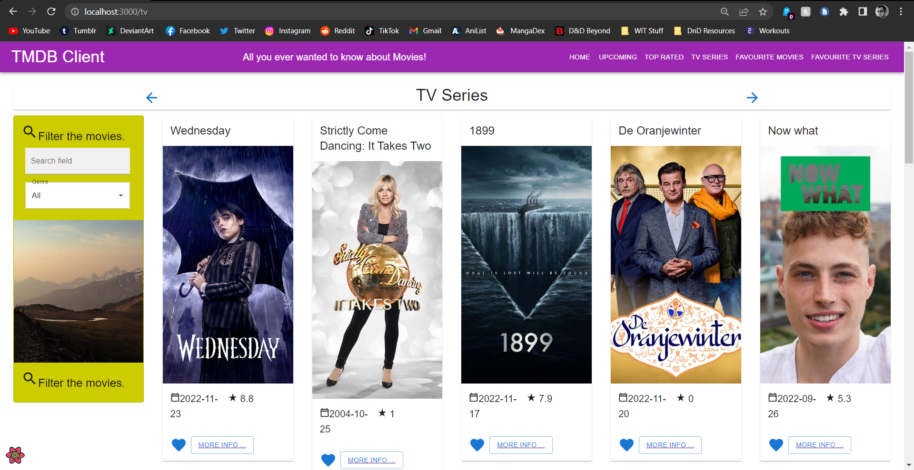

>Shows the Discover TV Series Page. This is a list of TV Series that is picked by the API.

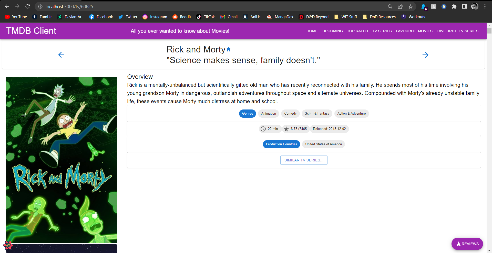

>Shows the TV Series Details Page. Contains information about the TV Series, along with the "Similar TV Series..." button, similar to the Movie Details page.

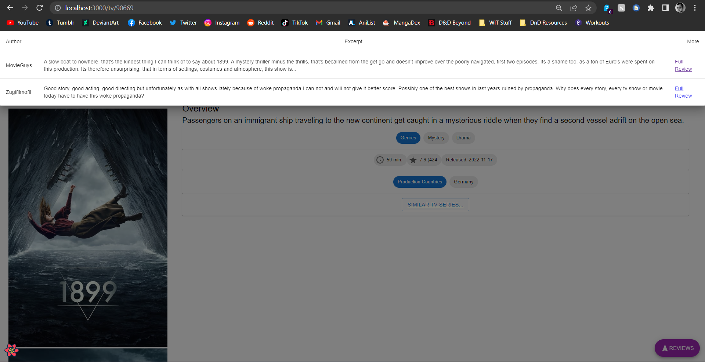

>Shows the list of available reviews for the selected TV Series, along with a button to view the full review.

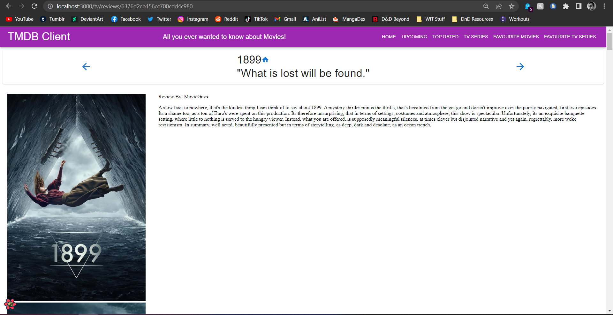

>Shows the selected review in full.

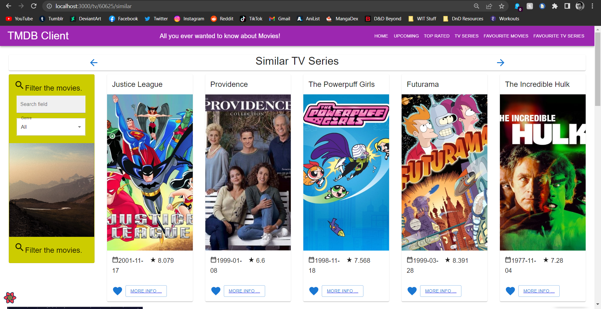

>Shows the Similar TV Series page. The implementation is the same as with the Similar Movies Page, except this is done for TV series.

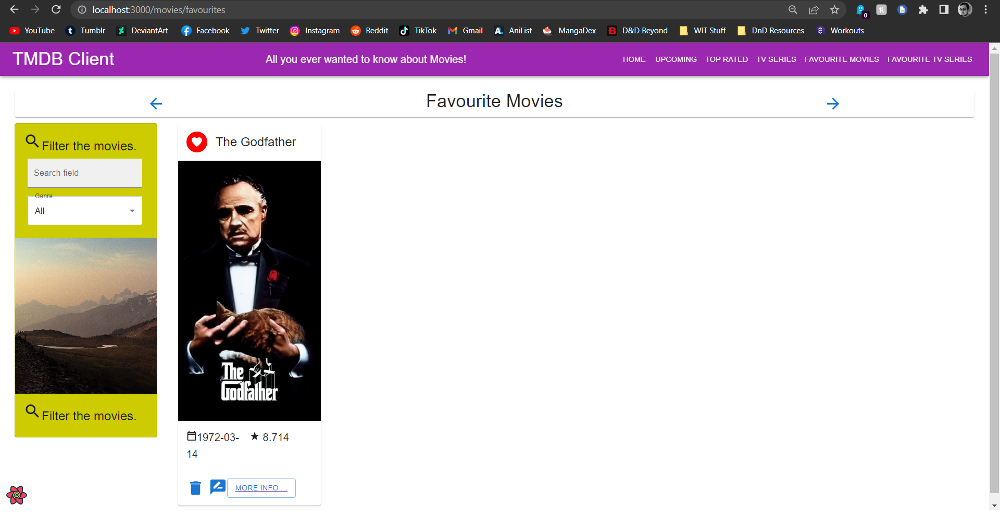

>Shows the Favourite Movies page. Not much changed, except the Site Header, to allow differentiation between the Favourite Movies and Favourite TV Series page.

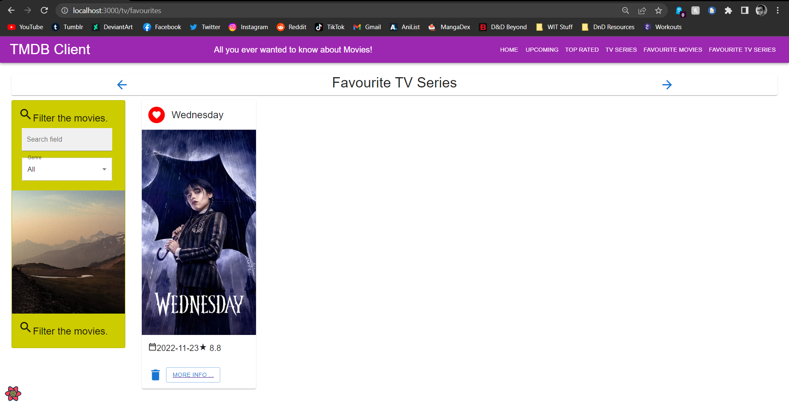

>Shows the Favourite TV Series page. Similar to the Favourite Movies Page, except it is linked to the TV Series.

### Routing.

[ List the __new routes__ supported by your app and state the associated page.]

+ /movies/toprated - List of Top rated movies.
+ /movies/:id/similar - List of Similar movies.
+ /tv - List of TV series.
+ /tv/:id - TV Details page.
+ /tv/:id/similar - List of Similar TV Series.
+ /tv/favourites - List of favourited TV Series.
+ /tv/reviews/:id - Show the specific review for the selected movie.

## Independent learning (If relevant).

+ None.
